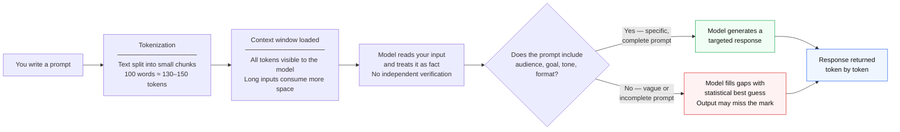

# 01: What Is AI?


## Lesson Purpose

This lesson gives you a solid, practical mental model for generative AI. By the end, you will understand what AI is actually doing when it responds to you, why the quality of your input determines the quality of the output, and where the real risks live.

The goal is not to make you an AI engineer. The goal is to make you a confident, careful AI user — someone who can apply these tools to real work without being misled by polished-looking but unreliable output.

This lesson is the foundation for everything that follows. If you understand what AI is doing under the hood, even at a high level, every other lesson will make more sense.

## Timing Plan

| Time | Activity | Outcome |
| ---: | --- | --- |
| 0-5 min | Opening scenario | You see why AI matters in daily work |
| 5-15 min | What generative AI does | You understand prediction, text generation, and chat history |
| 15-25 min | Tokens and context windows | You understand token limits and why long inputs need structure |
| 25-35 min | Capabilities and limitations | You separate useful tasks from risky tasks |
| 35-45 min | Exercise and review | You explain AI to a selected audience in your own words |

---

## What Generative AI Actually Does

The phrase "artificial intelligence" sounds like science fiction. In practice, the tools you will use in this course — ChatGPT, Claude, Gemini, and similar systems — are text prediction engines trained on enormous amounts of human-written content.

When you send a message to one of these systems, it does not search a database. It does not look something up. It generates a response token by token, based on patterns learned during training. Each word it produces is, statistically speaking, the most likely useful continuation of what came before.

This is both its greatest strength and its greatest weakness.

**The strength:** the model has absorbed patterns from millions of articles, books, manuals, conversations, and documents. It can produce fluent, well-structured, contextually appropriate text very quickly.

**The weakness:** it does not know what is true. It knows what sounds right based on patterns. This means it can confidently produce text that is grammatically perfect, logically structured, and completely wrong.

> **Key insight:** AI does not reason the way you do. It does not look things up, verify claims, or flag uncertainty the way a careful colleague would. It generates text that looks like good reasoning because it has seen what good reasoning looks like.

---

## Key Terms

| Term | Plain English meaning | Why it matters |
| --- | --- | --- |
| Generative AI | AI that creates new content — text, images, code, summaries | This is the category of tools in this course |
| Prompt | The instruction or question you give AI | The prompt shapes the answer |
| Token | A small chunk of text — roughly a word, syllable, or punctuation mark | Long prompts and long answers have limits and costs |
| Context window | The total amount of text the model can "see" at once | Everything outside the window is invisible to the model |
| Chat history | Previous messages in the same conversation | The model can use earlier instructions and facts |
| Output limit | The maximum response length the model can return | Long tasks may need splitting into steps |
| Hallucination | A confident answer that is factually wrong or invented | Important claims must always be checked |
| Grounding | Connecting an answer to provided sources or facts | Grounded output is easier to trust and verify |
| Temperature | A setting that controls how creative or predictable the output is | Higher temperature = more creative; lower = more consistent |
| Fine-tuning | Training a base model further on specific data | Makes models better at specialized tasks |

---

## How the Model Reads Your Prompt

Before the model writes a single word of its response, it reads your entire prompt as a sequence of tokens. Think of a token as a puzzle piece — it might be a whole word like "manager," half a word like "summar" from "summarize," or a punctuation mark like a comma.

A rough rule of thumb: 100 words is approximately 130 to 150 tokens.

Here is why this matters in practice:

1. **Everything you write costs tokens.** A long system prompt, pasted document, and detailed instructions all consume part of the available context window.
2. **Vague prompts force the model to guess.** When your prompt leaves out audience, goal, tone, and format, the model fills in those gaps with its own statistical best guess — which may not match what you needed.
3. **The model treats your prompt as the truth.** If you say "our product has 50,000 users," the model will use that figure. It does not independently verify what you tell it.

> **Tip:** Think of your prompt as a briefing document for a highly capable intern who has never worked at your company. They will follow your instructions carefully, but they will not ask a clarifying question unless you tell them to. Give them everything they need to do the job well.



---

## The Context Window: What AI Can and Cannot Remember

Every model has a context window — a limit on how much text it can hold in "working memory" at one time. As of 2025, many models support windows of 100,000 tokens or more, which is roughly the length of a short novel.

But context windows have a practical ceiling that catches beginners by surprise:

- **If a conversation runs long**, early instructions may fall outside the context window. The model may seem to "forget" them.
- **If you paste a long document**, the model sees all of it, but it may give more weight to content near the start or end.
- **If your prompt is too short**, the model does not have enough direction and makes assumptions.

### Practical Strategies for Long Inputs

| Situation | Strategy |
| --- | --- |
| Long document to summarize | Split into sections; summarize each, then summarize the summaries |
| Long conversation | Restart with a fresh summary prompt at the top |
| Very detailed task | Break into sequential steps; review output at each step |
| Multiple documents | Paste one at a time and ask for partial analysis |
| Important instruction | Put it at the beginning and repeat key constraints at the end |

> **Note:** Do not paste a long document and ask for everything at once. You will get a surface-level answer. Structured inputs produce structured outputs.

---

## Scenario: The Customer Comment Problem

A department receives 200 customer comments after launching a new service. The team manager wants to know:

- What customers like.
- What customers are frustrated by.
- What questions appear repeatedly.
- What content should be created next.

A beginner's approach: copy all 200 comments into the chat box and write "Summarize these."

A professional's approach:

1. Classify comments into categories first: praise, complaint, question, suggestion.
2. Summarize each category separately.
3. Identify the top three themes per category.
4. Generate content recommendations based on the themes.
5. Mark any findings that are inferences rather than direct quotes.

The second approach produces more reliable, more actionable output — and it also leaves a clearer trail for review.

---

## What AI Is Well Suited For

In a business or learning setting, the following tasks consistently produce good results with well-structured prompts:

- **Summarizing** meetings, articles, policies, and notes.
- **Rewriting** content for a different audience or reading level.
- **Classifying** text into labels such as positive, neutral, and negative.
- **Drafting** emails, posts, reports, and outlines.
- **Brainstorming** ideas, angles, objections, and questions.
- **Creating** templates, checklists, tables, and structured formats.
- **Explaining** complex topics in simpler language.
- **Reviewing** drafts for clarity, missing information, or tone.
- **Translating** between technical and plain English.
- **Generating** multiple versions of the same content for testing.

Notice that most of these involve organizing, reshaping, or generating language — tasks where the model's pattern-matching strength is directly useful and where a human can quickly review the output for accuracy.

---

## Where AI Creates Real Risk

AI should not be treated as an authority for facts unless it has been given reliable source material to work from. Even when it sounds authoritative, it may be wrong.

The following categories carry higher risk:

| Risk area | Why |
| --- | --- |
| Legal, financial, or medical advice | AI does not know your specific situation, jurisdiction, or current laws |
| Statistics and research claims | It may generate plausible-sounding numbers that are invented |
| Personal or confidential data | Input data may be logged and used for model training in some tools |
| Company policies and processes | AI does not know your internal rules unless you provide them |
| Decisions affecting people | Hiring, access, eligibility, and safety decisions need human judgment |
| Public statements and guarantees | Once published, incorrect claims are your responsibility |

> **Warning:** Never paste confidential information — customer records, employee details, financial data, unreleased product plans, or internal contracts — into a public AI tool unless your organization has approved that specific tool for that specific use case. Read the privacy policy. When in doubt, ask your manager or IT team before using AI on sensitive material.

---

## Common Misconceptions About AI

These are the ones that trip up beginners most often:

**"AI is searching the internet for my answer."**
Most chat-based AI tools are not live search engines. They generate responses from their training data, which has a knowledge cutoff date. Some tools have optional web search, but the base model does not browse.

**"If AI sounds confident, it must be right."**
Confidence in tone has nothing to do with accuracy. The model has no way to flag uncertainty the way a human expert would say "I'm not sure, let me check." It generates fluent, confident text regardless of whether the underlying claim is supported.

**"AI understands me."**
AI processes your text and produces a statistically likely response. It does not have intent, context about your situation, or memory between separate conversations. What feels like understanding is pattern-matching at scale.

**"A longer, more detailed prompt is always better."**
More context helps, but only useful context. Padding your prompt with irrelevant detail dilutes it. The goal is precise, relevant information — not length.

**"AI will replace my job."**
The more accurate framing: AI can replace specific tasks within many jobs. The people who use AI well will have a significant advantage over those who do not. Learning to use it carefully and critically is a professional skill.

---

## How Modern AI Systems Are Built

Most beginners think of AI as a single box: you type a message, it replies. In practice, production AI systems — the ones used in businesses, customer support teams, and content operations — are assembled from several layers that each play a specific role.

Understanding this structure makes you a smarter user. It explains why some prompts produce reliable results and others produce confident-sounding guesses.

| Layer | What it does | What it means for you |
| --- | --- | --- |
| Language model (LLM) | Generates text by predicting likely continuations | The core engine — everything else is built around it |
| Retrieval-augmented generation (RAG) | Connects the model to external documents or databases | Enables source-grounded answers instead of memory-based guesses |
| Knowledge base | Stores domain-specific content the model can retrieve | Improves accuracy on specialized or organizational topics |
| Ethics and safety layer | Filters harmful, misleading, or inappropriate output | Reduces risk — but does not eliminate the need for human review |
| Interaction interface | Handles text, voice, images, and multi-modal input | Allows different ways of interacting with the same underlying model |
| External integrations | Connects AI to APIs, calendars, email, and other tools | Enables the model to take actions, not just produce text |
| Governance and auditability | Logs decisions and maintains accountability records | Required in regulated industries; best practice everywhere else |

**Why this matters for prompt engineering:**

When you paste source material into your prompt, you are doing manually what a RAG layer does automatically in enterprise systems. You are giving the model verified, specific information to work from instead of asking it to reconstruct facts from training data. This is the single most reliable way to improve output quality.

When AI tools are connected to external systems — document stores, calendars, email — they can do more than answer questions. They can act. This is called agentic AI. The more capable the system, the more important it becomes that your instructions are clear, bounded, and reviewable.

> **Key insight:** The quality of your prompt matters regardless of whether the system is simple or sophisticated. A vague prompt fed to a powerful system produces a confident, polished, wrong answer. A well-structured prompt fed to even a basic tool produces something useful.

---

## Two Ways to Work With AI: Using Models vs. Building Them

As AI becomes a standard part of the workplace, it helps to understand the two fundamentally different roles people play in relation to these systems:

| Role | What they do | Tools they use |
| --- | --- | --- |
| AI user (builds with AI) | Uses AI tools to get work done faster — writing, research, content, automation | Prompt engineering, context files, RAG, workflow design |
| AI developer (builds AI) | Trains, fine-tunes, and evaluates language models themselves | Model architecture, optimization, training data, benchmarking |

This course is for AI users — people who want to get real work done with existing tools. You do not need to understand neural networks to write effective prompts. You do need to understand what the model is doing, what it can and cannot know, and how your prompt shapes its behavior.

> **Note:** The distinction matters because it defines what you need to learn. AI users need to understand prompting, grounding, review, and responsible use. AI developers need mathematics, data science, and systems engineering. Both are valuable. This course focuses on the first.

---

## Demonstration Prompt

This prompt puts the lesson into practice immediately:

```text
Act as a workplace training assistant.

Explain generative AI to a business audience who have never used it before.

Include:
1. What generative AI does in one plain English sentence.
2. What a prompt is and why it matters.
3. What tokens and context windows mean, using a simple analogy.
4. Two concrete workplace examples: one where AI clearly helps, one where it creates risk.
5. Three things a user should always check before using AI output.

Constraints:
- No technical jargon unless you define it immediately after using it.
- Do not claim AI is infallible or that it replaces human judgment.
- Keep the total response under 400 words.
- Format as numbered sections with short paragraph under each heading.
```

After running this prompt, examine the output critically:
- Did the model follow all the instructions?
- Did it use any jargon it failed to define?
- Did it stay under 400 words?
- Were the workplace examples realistic?

This evaluation habit — comparing output to your stated criteria — is the core skill of prompt engineering.

---

## Discussion Questions

These questions work best in a group, but they are also useful for individual reflection:

1. Think of one repeated task in your work or study that involves writing, organizing, or summarizing. How might AI assist with that task?
2. What information would AI need from you before it could help with that task well?
3. Where in that workflow should a human review the output before it is used?
4. What would happen if AI got that task wrong — and what are the consequences?

---

## Exercise: Explain AI to Your Audience

Write a prompt that asks AI to explain generative AI to one of the following audiences. Choose the audience most relevant to your current work or study:

- A business owner who wants to know if AI can save time on marketing.
- A department manager evaluating AI tools for their team.
- A corporate employee who will start using AI for internal reports.
- A student preparing to use AI for research and writing assignments.

Your prompt must include all five of the following elements:

| Element | What to include |
| --- | --- |
| Role | Who should AI "act as" |
| Audience | Who will read the output |
| Goal | What the audience needs to understand or decide |
| Format | How the output should be structured |
| One constraint | Something the output must not do |

After running your prompt, evaluate the output:
- Does it speak to the right audience?
- Does it include a practical example?
- Does it mention at least one limitation?
- Would your target audience trust this explanation?

---

## Review Checklist

Before moving to the next lesson, confirm you can answer yes to each of these:

- [ ] Can I explain in plain English what a large language model does?
- [ ] Do I understand what tokens and context windows are, and why they matter?
- [ ] Can I name three tasks where AI is reliably useful?
- [ ] Can I name three situations where AI output must be reviewed carefully?
- [ ] Do I know what hallucination means and why it happens?
- [ ] Have I written and tested at least one structured prompt?
